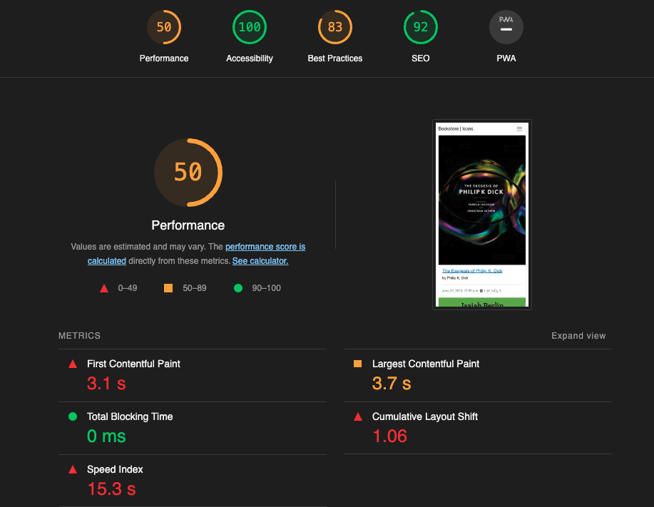

# **Testing**

## **Code Validation**

HTML

The HTML files were validated with the [W3C Validator Service](https://validator.w3.org/).

- Home page - PASS

CSS

The CSS file was validated using the [W3C Jigsaw Validator Service](https://jigsaw.w3.org/css-validator/).
It passed the validation process without warnings or errors.

Python

The Python files were validated using the [Pep8 linter](https://pep8ci.herokuapp.com/#)

- models.py - PASS

- forms.py - PASS

- views.py - PASS

- admin.py - PASS

## **Lighthouse**

- Home

- Sign In

## **Program Testing**

Some tests were programmed to check data integrity in models, views and forms.

## **Manual Testing**

| Registration | Expected results |
| --- | ---|
| A username is required | If the cell is empty an error message is shown. |
| A password is required | An error message is shown if the password is invalid or missing. |
| An email is optional | Shouldn't be an error message shown if left empty and no verification required. |
| Sign up button | The registration button validates the form and the user can log in afterwards. |

| Login/Logout | Expected results |
| --- | --- |
| Login | Prior registration is required for the user to be able to log in. The login fields are mandatory. Once a user is logged in, they can access the commenting and book reservation request functions. If the user is not logged in, an error page will be displayed when browsing these pages. |
| Logout | The logout option is only available to registered users. By clicking the logout button, the user should not have access to the previously available functions and should be able to navigate back to the login form. |

| Loan management | Expected results |
| --- | --- |
| Reservation request | The user must be registered to request a book as a loan. Once it is possible to access the details of a book or the loan menu, he/she will be able to request the reservation of a book to access the loan. The administrator would change the status from reserved to loan once the physical book is accessed. There is a 7-day time limit to access the physical book. |
| Reserve modification | The user must be logged in and be the author of the reservation in order to be able to modify (cancel) it. If you are not logged in and navigate to the loan page you should be redirected to a 404 or 403 error page. |
| Reserve deletion | The user must be logged in and be the author of the reservation to be able to delete it (within 7 days). If you are not logged in but navigate to that page anyway, you should be redirected to a 403 or 404 error page.|
| Loan deletion | It is not possible to delete or assign loan status directly from the website by the user. This action can only be done by the administrator from the administration area once the physical book has been accessed or returned.|

| Commenting | Expected results |
| --- | --- |
| See comments | Any user should be able to see the comments under a book. |
| Commenting | The user should be able to comment under a book if they are logged in. The admin has to approve the comment before it is visible on the page. |
| Delete comments | Registered users can view and delete approved comments under their authorship. |

| Error pages | Expected results |
| --- | --- |
| Custom error pages | The user should be redirected to one of the custom error pages if their request is invalid or some other interference occurs. On the error page they should be able to navigate back to he home page via the button under the error message or via the navigation bar.

| Navigation | Expected results |
| --- | --- |
| Navbar | The navbar buttons are named conveniently so that the user can expect that upon clicking them they will get to the page the link indicates. Different navbar links are available for authenticated and non-authenticated users. |
| Buttons or actions links | Submit buttons or links to reserve a book, or remove the reservation are indicative of the action to which they lead. The user is redirected to the page where the action took place or receives a message confirming the requested action. |

## **Bugs**

- Fixed bugs

    - Initially I had problems editing the loan table, but the error was that I had not imported and registered the model in admin.py. Once corrected, the problem was solved.

    - I had trouble rendering the book detail page in relation to the fields I wanted to add for loans but I was able to fix it by adding the loan data and passing it as a variable for manipulation in the template.

- Unfixed bugs

    - The Django frameworks handles the registration process, I have not created a custom registration. There is a problem with registration, where if the user creates a weak password, they receive an error that the password is too weak, but then they can no longer register with the same email address, so the user is created anyway, despite the problem.
    - In the administration area, when adding a book, if a field fails (required), the cover image is deleted and the book is not saved, so you have to insert the image again and repeat the saving process.

Return to [README.md](README.md)